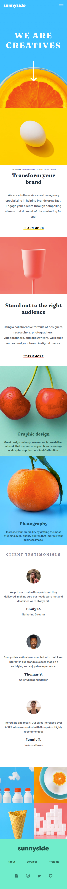
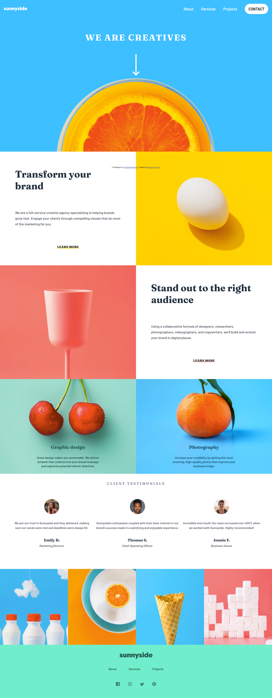

# Frontend Mentor - Sunnyside agency landing page solution

This is a solution to the [Sunnyside agency landing page challenge on Frontend Mentor](https://www.frontendmentor.io/challenges/sunnyside-agency-landing-page-7yVs3B6ef). Frontend Mentor challenges help you improve your coding skills by building realistic projects.

## Table of contents

- [Overview](#overview)
  - [The challenge](#the-challenge)
  - [Screenshot](#screenshot)
  - [Links](#links)
- [My process](#my-process)
  - [Built with](#built-with)
  - [What I learned](#what-i-learned)
  - [Continued development](#continued-development)
  - [Useful resources](#useful-resources)
- [Author](#author)

## Overview

### The challenge

Users should be able to:

- View the optimal layout for the site depending on their device's screen size
- See hover states for all interactive elements on the page

### Screenshot

### Links

- Live Site URL: [Netlify](https://your-live-site-url.com)

## My process

### Built with

- Semantic HTML5 markup
- CSS custom properties
- Flexbox
- JavaScript
- Mobile-first workflow

### What I learned

In this challenge I think I could solidify my knowledge about background images. This is a really nice template I can reuse in other projects.  
  
And this is the first project where I try to use the CSS only in classes, not in HTML tags. This allows to build more dynamic HTML Semantic, improving the refactories in future.

### Continued development

The CSS file it's really big. I should study how to use the @import, at least to put the media queries in other files. Also use SASS.

### Useful resources

- [The use of cite and blockquote tags](https://www.w3.org/TR/html52/textlevel-semantics.html#the-cite-element) - This was the first project where I used this tags. It's a better markup and semantic for HTML.

## Author

- Website - [Renato Novaes](https://www.renatonovaes.dev)
- Instagram - [@novaes_r](https://www.instagram.com/novaes_r)
